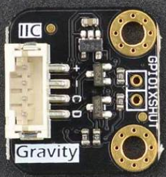
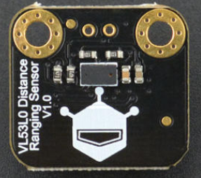

# DFRobot_VL53L0X

* [中文版](./README_CN.md)

World smallest Time-of-Flight ranging and gesture detection sensor.



## Product Link（[https://www.dfrobot.com/product-1706.html](https://www.dfrobot.com/product-1706.html)）
    SKU: SEN0245
   
## Table of Contents

* [Summary](#summary)
* [Installation](#installation)
* [Methods](#methods)
* [Compatibility](#compatibility)
* [History](#history)
* [Credits](#credits)

## Summary
This library provides the VL53L0X laser rangefinder API function.

## Installation

To use this library, first download the library file, paste it into the \Arduino\libraries directory, then open the examples folder and run the demo in the folder.

## Methods
```C++
  /**
   * @fn DFRobot_VL53L0X
   * @brief DFRobot_VL53L0X abstract class constructor.
   */
  DFRobot_VL53L0X();
  ~DFRobot_VL53L0X();
  /**
   * @fn begin
   * @brief Init sensor and set I2C sub-device address.
   * @param addr 7 bits I2C address: 1~127
   * @return NONE
   */
  void begin(uint8_t addr = VL53L0X_DEF_I2C_ADDR);	
  /**
   * @fn setMode
   * @brief Set operational mode to VL53L0X sensor.
   * @param mode Work mode settings
   * @n     eSingle      Single mode
   * @n     eContinuous  Back-to-back mode
   * @param precision Set measurement precision
   * @n     eHigh  High precision(0.25mm)
   * @n     eLow   Low precision(1mm)
   * @return NONE
   */
  void setMode(eModeState mode, ePrecisionState precision);
  /**
   * @fn start
   * @brief Start measuring distance.
   */
  void start();
  /**
   * @fn stop
   * @brief Stop measurement.
   */
  void stop();
  /**
   * @fn getDistance
   * @brief This function returns the distance measured by the sensor in mm.
   * @return The detailed distance
   */
  float getDistance();
  /**
   * @fn getAmbientCount
   * @brief Get ambient count.
   * @return Ambient count.
   */
  uint16_t getAmbientCount();
  /**
   * @fn getSignalCount
   * @brief Get signal count.
   * @return Signal count.
   */
  uint16_t getSignalCount();
  /**
   * @fn getStatus
   * @brief Get Status flag.
   * @return Status flag.
   */
  uint8_t getStatus();
```

## Compatibility

MCU                | Work Well | Work Wrong | Untested  | Remarks
------------------ | :----------: | :----------: | :---------: | -----
FireBeetle-ESP32  |      √       |             |            | 
FireBeetle-ESP8266  |      √       |             |            | 
FireBeetle-BLE4.1 |      √       |             |            | 

## History

- 2017/08/21 - Version 1.0.0 released.

## Credits

Written by lixin(xin.li@dfrobot.com), 2017. (Welcome to our [website](https://www.dfrobot.com/))