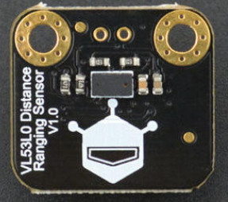

# DFRobot_VL53L0X

* [English Version](./README.md)

VL53L0X激光测距传感器是一款基于意法半导体（STMicroelectronics）新出的基于飞行时间测距 (ToF) 原理设计的高精度测距传感器。与传统的技术不同，VL53L0X无论目标反射率如何，都能提供精确的距离测量，最高测量距离2米。<br>




## Product Link（[https://www.dfrobot.com.cn/goods-1643.html](https://www.dfrobot.com.cn/goods-1643.html)）
    SKU: SEN0245
   
## Table of Contents

* [概述](#概述)
* [库安装](#库安装)
* [方法](#方法)
* [兼容性](#兼容性)
* [历史](#历史)
* [创作者](#创作者)

## 概述

该库提供 VL53L0X 激光测距仪 API 函数。

## 库安装

使用此库前，请首先下载库文件，将其粘贴到\Arduino\libraries目录中，然后打开examples文件夹并在该文件夹中运行演示。

## 方法

```C++
  /**
   * @fn DFRobot_VL53L0X
   * @brief DFRobot_VL53L0X构造函数
   */
  DFRobot_VL53L0X();
  ~DFRobot_VL53L0X();
  /**
   * @fn begin
   * @brief 初始化传感器，并设置其I2C地址.
   * @param addr 7位I2C地址，范围:1~127
   * @return 无
   */
  void begin(uint8_t addr = VL53L0X_DEF_I2C_ADDR);	
  /**
   * @fn setMode
   * @brief 设置VL53L0X 传感器的工作模式。.
   * @param mode 测量模式
   * @n     eSingle      单次测量模式
   * @n     eContinuous  连续测量模式
   * @param precision 设置测量精度
   * @n     eHigh  高精度(0.25mm)
   * @n     eLow   低精度(1mm)
   * @return 无
   */
  void setMode(eModeState mode, ePrecisionState precision);
  /**
   * @fn start
   * @brief 开始测量.
   */
  void start();
  /**
   * @fn stop
   * @brief 停止测量.
   */
  void stop();
  /**
   * @fn getDistance
   * @brief 获取测来测量数据，单位: mm.
   * @return 测量数据
   */
  float getDistance();
  /**
   * @fn getAmbientCount
   * @brief 获取环境量.
   * @return 环境量.
   */
  uint16_t getAmbientCount();
  /**
   * @fn getSignalCount
   * @brief 获取信号数.
   * @return 信号数.
   */
  uint16_t getSignalCount();
  /**
   * @fn getStatus
   * @brief 获取状态标志.
   * @return 状态标志.
   */
  uint8_t getStatus();
```

## 兼容性

MCU                | Work Well | Work Wrong | Untested  | Remarks
------------------ | :----------: | :----------: | :---------: | -----
FireBeetle-ESP32  |      √       |             |            | 
FireBeetle-ESP8266  |      √       |             |            | 
FireBeetle-BLE4.1 |      √       |             |            | 

## 历史

- 2017/08/21 - 1.0.0 版本

## 创作者

Written by lixin(xin.li@dfrobot.com), 2017. (Welcome to our [website](https://www.dfrobot.com/))


